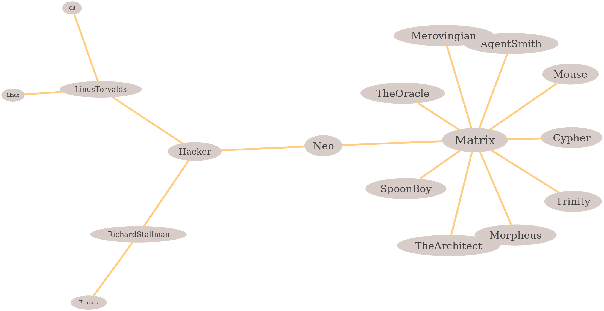

<h1 align="center">
	</img>
	<br>
</h1>

# Trinity
generating a graph based on links among files.

# Idea
I developed trinity since i need a tool to show me all the relationships and links between my files. (i use these linked, to make a second brain.)

The idea is simple. i have bunch of simple `.txt` files in a flat hierarchy structure that can refer to each other.(like in **docs** directory)

to create a graph of links:

`./trinity.sh --output-dir output --input-dir docs --input-file Matrix.txt --open-img > /dev/null  2>&1`

it will create two files in output directory:
1. Matrix.gv
2. Matrix.png

actually i converted all links that i find inside input file to [dot language](https://en.wikipedia.org/wiki/DOT_(graph_description_language)) and then create an image from it.

this is the content of auto-generated `.gv` file:
```
graph Matrix {
  layout=sfdp;
  edge [penwidth=5 color="#FFCC80"]
  node [style="filled" penwidth=0 fillcolor="#D7CCC8" fontcolor="#424242"]

  Matrix [fontsize=33]

  node [fontsize=28]
  Matrix -- {
    Neo
    Mouse
    Cypher
    Trinity
    Morpheus
    SpoonBoy
    TheOracle
    AgentSmith
    Merovingian
    TheArchitect
  }

  node [fontsize=24]
  Neo -- {
    Hacker
  }

  node [fontsize=20]
  Hacker -- {
    RichardStallman
    LinusTorvalds
  }

  node [fontsize=16]
  RichardStallman -- {
    Emacs
  }

  node [fontsize=12]
  LinusTorvalds -- {
    Linux
    Git
  }

  graph [ranksep=6];
}
```

now you can open the image:

`xdg-open output/Matrix.png > /dev/null 2>&1`

To see other options: `trinity.sh --help`.

## dependencies
- [graphviz](https://graphviz.org/)

## Who is Trinity
<h1 align="center">
	
	<br>
</h1>

## License

